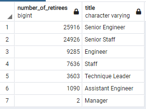

# Pewlett-Hackard-Analysis
## Purpose
This analysis was commissioned to analyze the overall age of the employees at Pewlett-Hackard, and address the possibility of a "Silver Tsunami" which would take experienced talent away from the company.
## Basic PH Statistics
- Total # of employees = 300,024
- Total # of departments = 9
- Total # of titles held by current employees = 443,308
## Tables Created
### Initial Tables
- Initial tables were created from .csv data provided
### retirement_titles
- Table created of every employee-title combination where the employee was born between 1952 and 1955, and potentially at the cusp of retiring.
- Duplicate employee entries are expected for any employees who have held more than one title at their time at Pewlett-Hackard.
- 133,776 total titles held, at any time, by potentially retiring employees
### unique_titles
- Table created based on retirement_titles, using DISTINCT ON to isolate a single entry per employee and to_date = '9999-01-01' to include only titles currently being held.
- 72,458 current employees with potential retirements
### retiring_titles
- Table created using GROUP BY to count the total number of retiring employees, grouped by title.

### mentorship_eligibility
- Table created of current employees who are eligibile to be mentors this year specifically - only those born in 1965.
- 1549 current employees born in 1965
